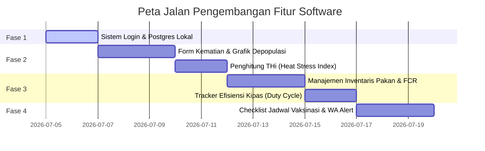

# Rencana Pengembangan Fitur Startup: Chikcoop Smart Poultry Farm (Berbasis Batasan Hardware main.cpp)

Dokumen ini disusun sebagai panduan pengembangan fitur web dashboard Chikcoop untuk diubah menjadi platform startup komersial yang kaya fitur, **tanpa menambah sensor atau mengubah hardware fisik** dari batasan yang ada di [main.cpp](file:///c:/Users/alvin/OneDrive/Dokumen/PlatformIO/Projects/SMARTCHICKENCOOP/src/main.cpp) (DHT11, MQ2 DO, PIR, Relay Kipas, LED, dan Buzzer).

Pengembangan difokuskan pada optimalisasi pengolahan data sensor di sisi server (Software & Analytics) untuk menghasilkan wawasan mendalam bagi peternak.

---

## 1. Fitur Analisis Cerdas Menggunakan Sensor yang Ada (Zero Hardware Addition)

Kita dapat menciptakan fitur-fitur premium di web dashboard dengan memaksimalkan kegunaan sensor yang sudah terpasang saat ini:

### A. Deteksi Stress Panas (Temperature-Humidity Index - THI)
*   **Konsep**: Ayam tidak memiliki kelenjar keringat. Kombinasi suhu tinggi dan kelembaban tinggi sangat mematikan (Heat Stress).
*   **Metode**: Menggunakan data **Suhu** dan **Kelembaban** dari sensor DHT11 yang sudah ada untuk menghitung indeks kenyamanan termal secara matematis di server menggunakan rumus THI:
    $$\text{THI} = (1.8 \times T + 32) - (0.55 - 0.0055 \times RH) \times (1.8 \times T - 26)$$
*   **Fitur Dashboard**: Menampilkan indikator kenyamanan ayam (Nyaman, Stress Ringan, Stress Berat/Bahaya) serta memberikan saran tindakan secara otomatis (misal: "Nyalakan kipas secara manual atau berikan es pada air minum").

### B. Deteksi Kehadiran Predator & Gangguan Malam (PIR Analytics)
*   **Konsep**: Ayam broiler tidur di malam hari dan pergerakannya sangat minim. Aktivitas gerakan yang tinggi di malam hari menandakan adanya predator (seperti tikus, kucing, atau ular) atau kepanikan massal.
*   **Metode**: Menganalisis log data dari sensor **PIR** (gerakan). Jika sensor PIR mendeteksi gerakan berulang-ulang di jam tidur ayam (misal jam 22:00 - 03:00):
*   **Fitur Dashboard**: Mengirimkan alarm darurat ke dashboard dan peringatan instan "Potensi Gangguan/Predator Terdeteksi di Kandang".

### C. Efisiensi Penggunaan Energi Blower (Duty Cycle Fan Tracker)
*   **Konsep**: Memantau kesehatan kipas exhaust dan konsumsi listrik.
*   **Metode**: Server melacak berapa lama status Kipas bernilai `ON` setiap harinya (diambil dari log status relay di database).
*   **Fitur Dashboard**: Menampilkan grafik durasi kipas menyala per hari dan estimasi biaya listrik yang dihabiskan kipas. Jika kipas menyala terus menerus selama 24 jam tapi suhu tidak turun, sistem akan memunculkan peringatan "Periksa Kipas, Efisiensi Pendinginan Menurun".

---

## 2. Fitur Manajemen Peternakan Murni Web (Pure Software Features)

Fitur-fitur ini berjalan sepenuhnya di sisi server web Next.js dan database PostgreSQL untuk membantu pengelolaan operasional harian peternak secara profesional:

### A. Pencatatan Kematian & Grafik Depopulasi (Mortality Log)
*   **Fitur**: 
    - Peternak dapat menginput jumlah ayam mati harian secara manual lewat form dashboard.
    - Sistem akan menghitung akumulasi kematian dan menampilkan grafik persentase depopulasi kandang.
    - Peringatan otomatis jika persentase kematian melampaui batas standar industri (misal >0.1% dalam sehari).

### B. Manajemen Pakan & Air Manual (Feed Inventory System)
*   **Fitur**:
    - Menu inventaris pakan untuk menginput stok karung pakan yang dibeli dan jumlah karung pakan yang diberikan ke ayam setiap hari.
    - Sistem menghitung sisa pakan yang tersedia secara otomatis di dashboard.
    - Analisis efisiensi pakan: Membandingkan konsumsi pakan harian dengan standar pertumbuhan ayam broiler berdasarkan usianya.

### C. Estimasi Berat & Perhitungan FCR (Feed Conversion Ratio)
*   **Fitur**:
    - Peternak melakukan sampling berat badan ayam seminggu sekali dan menginputnya ke dashboard.
    - Sistem akan secara otomatis menghitung nilai **FCR (Feed Conversion Ratio)**:
      $$\text{FCR} = \frac{\text{Total Pakan Dikonsumsi (kg)}}{\text{Total Berat Badan Ayam (kg)}}$$
    - Nilai FCR ini akan dibandingkan langsung dengan standar genetik ayam (Cobb 500 / Ross 308) untuk menilai apakah peternakan sedang untung atau rugi.

### D. Sistem Penjadwalan Vaksinasi & Checklist Harian
*   **Fitur**:
    - Saat siklus kandang baru dimulai, sistem akan otomatis membuat jadwal vaksinasi broiler (ND, Gumboro, Lasota) pada kalender dashboard.
    - Kalender ini akan memunculkan daftar checklist tugas harian bagi anak kandang (misal: "Hari 7: Vaksinasi Gumboro via Air Minum", "Hari 14: Semprot Desinfektan").

### E. Integrasi WhatsApp Peringatan Dini (WhatsApp Alerting)
*   **Fitur**:
    - Mengintegrasikan server dengan API gateway WhatsApp (seperti Twilio, Fonnte, dll).
    - Server akan otomatis mengirim pesan WA ke pemilik kandang jika:
      1. Suhu di atas threshold suhu saat ini.
      2. Gas amonia terdeteksi bahaya dari sensor MQ2.
      3. Kehilangan koneksi data (heartbeat offline) dari simulator/ESP32 selama lebih dari 5 menit.

---

## 3. Peta Jalan Pengembangan Fitur

